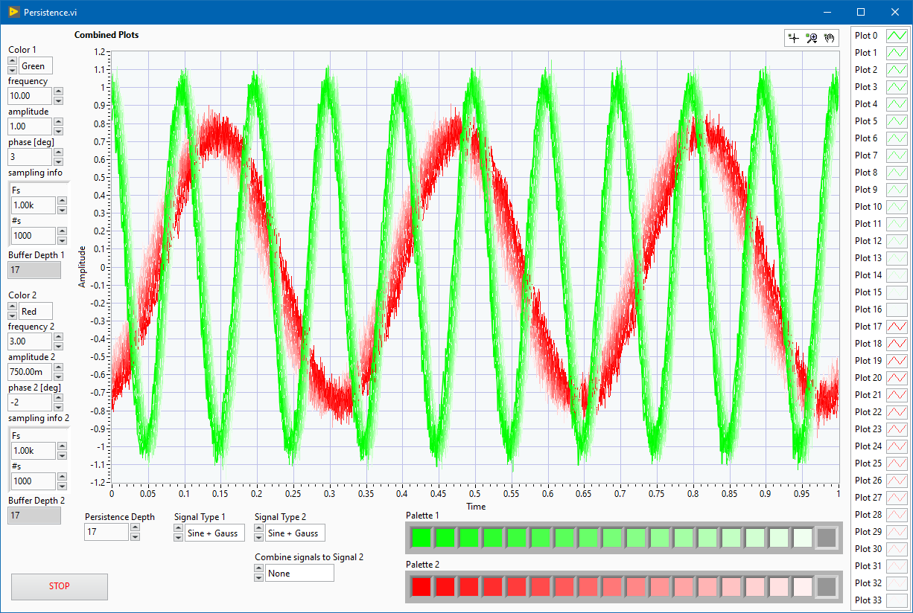

# lv_plot_persistence

Display signals with scope's persistence effect in LabVIEW's waveform graph

### Table of Contents (Wiki)
[Wiki Home](https://github.com/etfovac/lv_plot_persistence/wiki)  
[Overview](https://github.com/etfovac/lv_plot_persistence/wiki/Overview)  
[Notes](https://github.com/etfovac/lv_plot_persistence/wiki/Notes)  
[Examples](https://github.com/etfovac/lv_plot_persistence/wiki/Examples)  
[References](https://github.com/etfovac/lv_plot_persistence/wiki/References)  

[lv_plot_persistence](https://github.com/etfovac/lv_plot_persistence) is maintained by [etfovac](https://github.com/etfovac).
