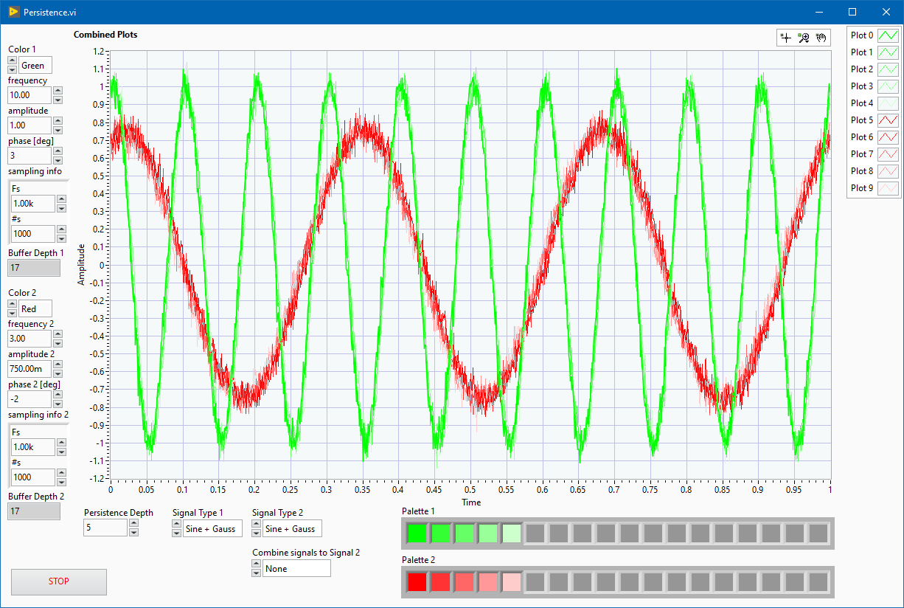
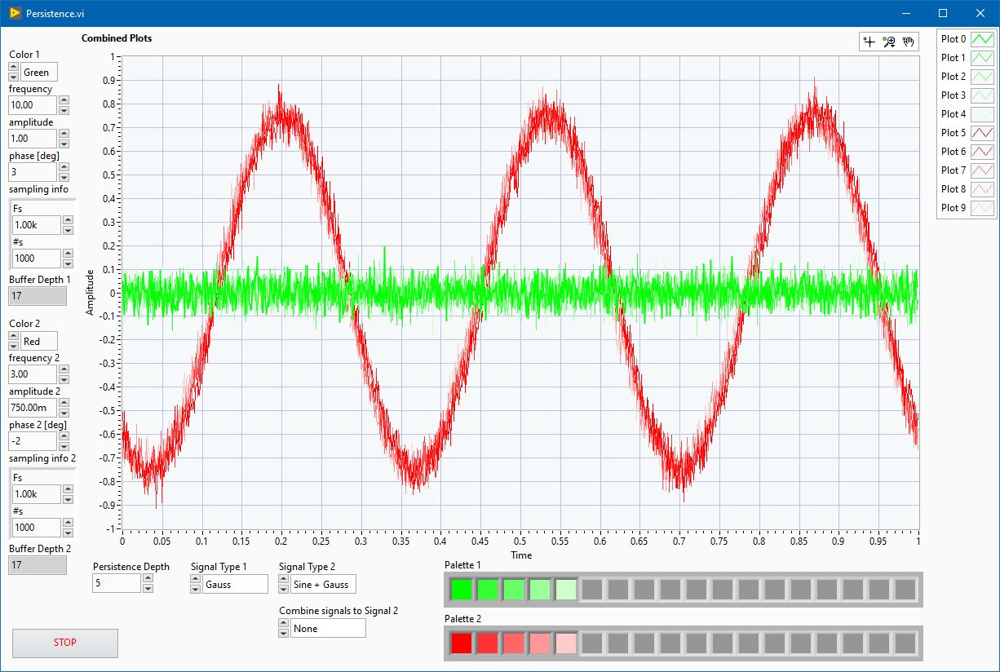
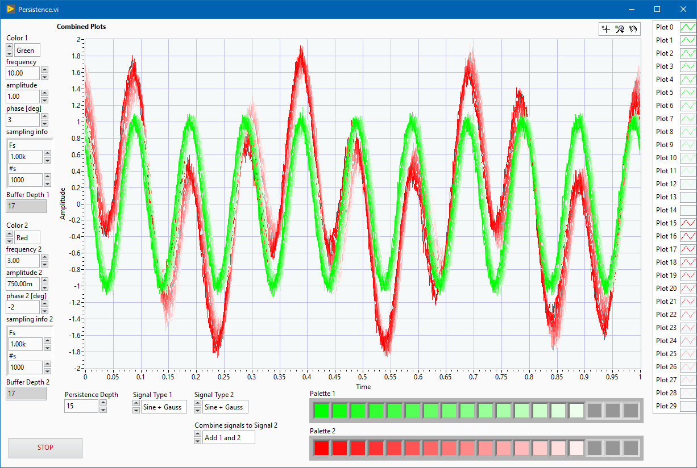
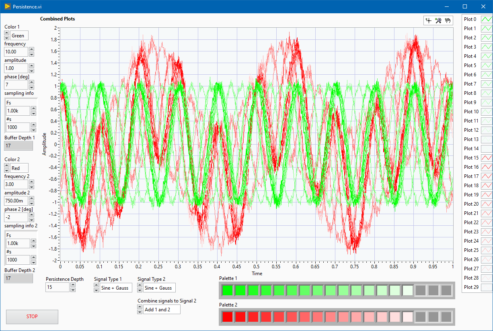
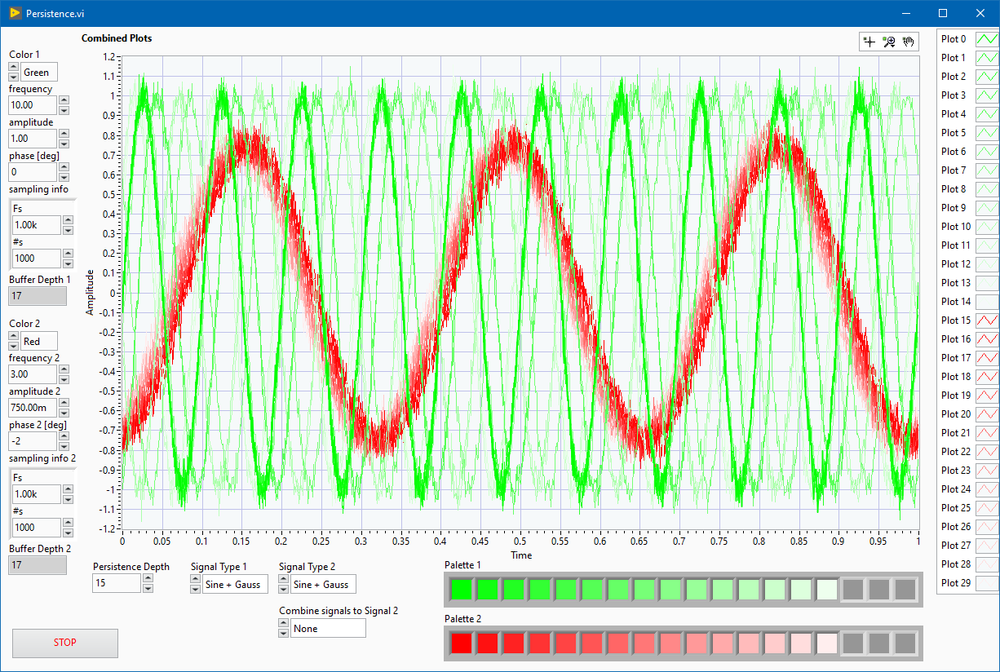

# Scope's persistence effect in waveform graph   

Display signals with scope's persistence effect in LabVIEW's waveform graph

Published also as an [NI Example](https://forums.ni.com/t5/Example-Code/Persistence-effect-in-waveform-graph/ta-p/4168343)

### Table of Contents (Wiki)
[Wiki Home](https://github.com/etfovac/lv_plot_persistence/wiki)  
[Overview](https://github.com/etfovac/lv_plot_persistence/wiki/Overview)  
[Notes](https://github.com/etfovac/lv_plot_persistence/wiki/Notes)  
[Examples](https://github.com/etfovac/lv_plot_persistence/wiki/Examples)  
[References](https://github.com/etfovac/lv_plot_persistence/wiki/References)  

### Persistence graph  
  
  
  
  
   
   

### Palette  
There is a custom PlotColor.vi that generates a palette for each buffered signal. 
It can switch from RGB-White to RGB-Black scale.

[lv_plot_persistence](https://github.com/etfovac/lv_plot_persistence) is maintained by [etfovac](https://github.com/etfovac).
